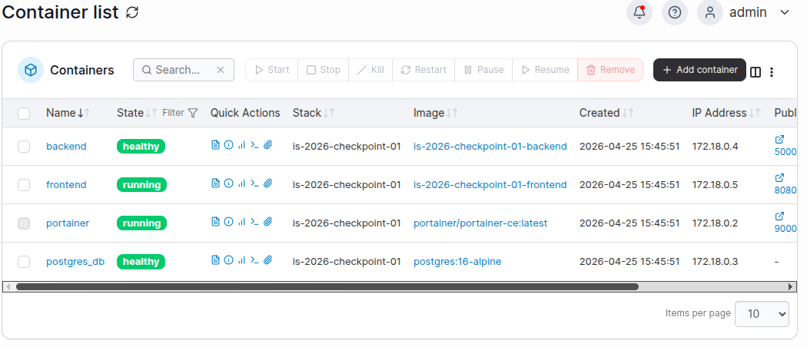
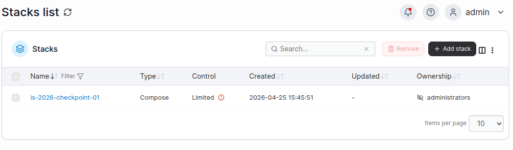
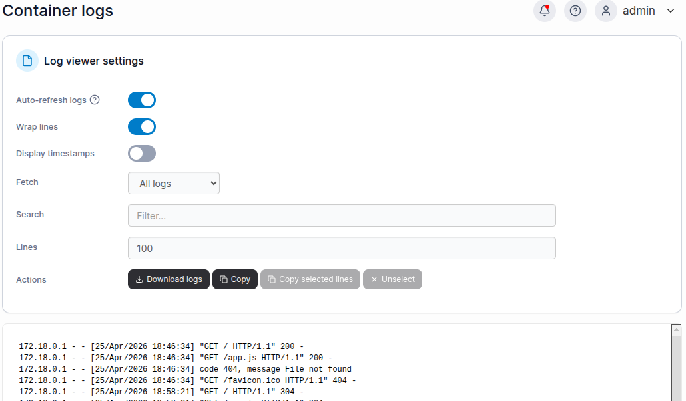

# TeamBoard App — is-2026-checkpoint-01

Aplicación web grupal desarrollada para la materia Ingeniería y Calidad de Software (2026).  
Muestra una tabla con los integrantes del equipo, la feature que implementó cada uno y el estado de su servicio.

---

## Flujo de trabajo con GitHub

- Cada integrante trabaja en su propia rama `feature/nombre-del-servicio`
- No se permite hacer push directo a `main`
- Todos los cambios ingresan mediante Pull Request
- Cada PR debe ser revisado y aprobado por al menos un compañero
- Nadie mergea su propio Pull Request

---
## Integrantes

| Nombre | Legajo | Feature | Servicio |
|---|---|---|---|
| Tassi	 Marcelo | 29680 | Feature 01 — Coordinación | docker-compose, README |
| Delozano	Matias | 27978 | Feature 02 — Frontend | frontend |
| Di Bella	Abel | 25619 | Feature 03 — Backend | backend |
| Llontop	Alejandro | 31890 | Feature 04 — Base de datos | database |
| Lafalce	Mateo | 33217 | Feature 05 — Portainer | portainer |

---

## Servicios

| Servicio | Puerto | Descripción |
|---|---|---|
| Frontend | 8080 | Página web que muestra la tabla de integrantes |
| Backend | 5000 | API REST que sirve los datos del equipo |
| Database | — | PostgreSQL, sin puerto público |
| Portainer | 9000 | Panel de monitoreo de contenedores Docker |

---

## Requisitos

- Docker
- Docker Compose

---

## Instalación y uso

1. Clonar el repositorio:
git clone https://github.com/TassiMarcelo/is-2026-checkpoint-01
cd is-2026-checkpoint-01

2. Copiar el archivo de variables de entorno:
cp .env.example .env
Completar los valores en el archivo `.env`.

3. Levantar los servicios:
docker compose up -d --build

4. Verificar que todos los servicios estén corriendo:
docker compose ps

5. Abrir en el navegador:
   - TeamBoard: http://localhost:8080
   - Portainer: http://localhost:9000

---

## Portainer — Panel de monitoreo

Portainer permite ver y administrar los contenedores del stack desde el navegador.

### Acceso

1. Levantar el stack con `docker compose up -d --build`.
2. Abrir <http://localhost:9000>.
3. **Primer ingreso**: Portainer solicita crear un usuario administrador (mínimo 12 caracteres). Esta configuración persiste en el volumen `portainer_data`.
4. Elegir "Get Started" para usar el entorno Docker local.

### Qué se ve

- Contenedores corriendo: `frontend`, `backend`, `postgres_db`, `portainer`.
- Stack agrupado bajo el proyecto `is-2026-checkpoint-01`.
- Logs, stats de CPU/memoria y healthchecks por contenedor.
- Volúmenes (`db_data`, `portainer_data`) y red `teamboard-net`.

Más detalles en [`portainer/README.md`](portainer/README.md).

### Capturas

| | |
|---|---|
| Listado de contenedores |  |
| Stack del proyecto |  |
| Logs de un servicio |  |

---

## Estructura del repositorio

```
is-2026-checkpoint-01/
├── docker-compose.yml
├── .env.example
├── .gitignore
├── README.md
├── frontend/
├── backend/
├── database/
└── portainer/
```